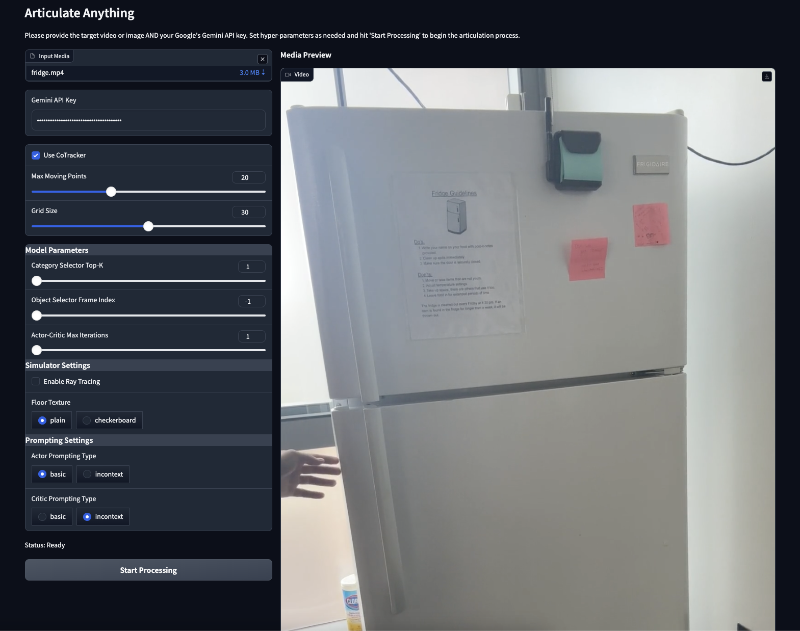

<p align="center">
  
</p>


<div align="center">

# Articulate Anything

[](https://github.com/vlongle/articulate-anything)
[](https://pytorch.org/)
[](https://opensource.org/licenses/MIT)
[](https://arxiv.org/abs/2410.13882)
[](https://huggingface.co/datasets/vlongle/articulate-anything-dataset-preprocessed/tree/main)


[[Project Website]](https://articulate-anything.github.io)
[[Paper]](https://arxiv.org/abs/2410.13882)
[[Twitter threads]](https://x.com/int64_le/status/1866519866934714623)

______________________________________________________________________

Articulate Anything is a powerful VLM system for articulating 3D objects using various input modalities.


https://github.com/user-attachments/assets/3c23f423-3bdd-4843-a4e3-e1c7f26bfc42


</div>

## Features

-  Articulate 3D objects from text 🖋 descriptions
-  Articulate 3D objects from 🖼 images
-  Articulate 3D objects from 🎥  videos


> 🚀 **QUICK START**: Skip preprocessing by downloading our preprocessed PartNet-Mobility dataset:
> 
> 🤗 [Articulate-Anything Dataset on Hugging Face](https://huggingface.co/datasets/vlongle/articulate-anything-dataset-preprocessed/tree/main)

To use an interactive demo, run
```bash
python gradio_app.py
```
**after** you have run the preprocessing steps as explained below in [Demo](#demo) section.



We use [Hydra](https://hydra.cc/) for configuration management. You can easily customize the system by modifying the configuration files in `configs/` or overload parameters from the command line. We can automatically articulate a variety of input modalities from a single command

```bash
   python articulate.py modality={partnet, text, image, video} prompt={prompt} out_dir={output_dir}
```
Articulate-anything uses a **actor-critic** system, allowing for self-correction and self-improvement over iterations. 

<!-- You can visualize the link prediction over time:


or the joint prediction over time:


in only a few lines of codes. See [ Open in Jupyter Notebook](examples/articulate_partnet.ipynb) for a more detailed guides.
 -->

See below for more detailed guides.

## Table of Contents

- [Installation](#installation)
- [Getting Started](#getting-started)
- [Usage](#usage)
  - [Demo](#demo)
  - [PartNet-Mobility Masked Reconstruction](#partnet-mobility-masked-reconstruction)
  - [Text Articulation](#text-articulation)
  - [Visual Articulation](#visual-articulation)
- [Notes](#notes)
- [Contact](#contact)
- [Citation](#citation)

## Installation

1. Clone the repository:
   ```bash
   git clone https://github.com/vlongle/articulate-anything.git
   cd articulate-anything
   ```

2. Set up the Python environment:
   ```bash
   conda create -n articulate-anything python=3.9
   conda activate articulate-anything
   pip install -e .
   ```

3. Download and extract the PartNet-Mobility dataset:
   ```bash
   # Download from https://sapien.ucsd.edu/downloads
   mkdir datasets
   mv partnet-mobility-v0.zip datasets/partnet-mobility-v0.zip
   cd datasets
   mkdir partnet-mobility-v0
   unzip partnet-mobility-v0 -d partnet-mobility-v0
   ```

## Getting Started

Our system supports Google Gemini, OpenAI GPT, and Anthropic Claude. You can set the `model_name` in the config file [conf/config.yaml](conf/config.yaml) to `gemini-1.5-flash-latest`, `gpt-4o`, or `claude-3-5-sonnet-20241022`. Get your API key from the respective website and set it as an environment variable:

   ```bash
   export API_KEY=YOUR_API_KEY
   ```

## Usage

We support reconstruction from in-the-wild text, images, or videos, or masked reconstruction from PartNet-Mobility dataset.

<h3 id="demo">Demo</h3>

1. First, preprocess the parntet dataset by running
   ```bash
   python preprocess_partnet.py parallel={int} modality={}
   ```
2. Run the interactive demo
   ```bash
   python gradio_app.py
   ```


<h3 id="partnet-mobility-masked-reconstruction">💾 PartNet-Mobility Masked Reconstruction</h3>


🐒 It's articulation time! For a step-by-step guide on articulating a PartNet-Mobility object, see the notebook:

   [ Open in Jupyter Notebook](examples/articulate_partnet.ipynb)

   or run

   ```bash
   python articulate.py modality=partnet prompt=149 out_dir=results/149
   ```
to run for `object_id`=149.

<h3 id="text-articulation">🖋 Text Articulation </h3>

1. Preprocess the dataset:
   ```bash
   python articulate_anything/preprocess/preprocess_partnet.py parallel={int} modality=text
   ```

Our precomputed CLIP embeddings is available from our repo in `partnet_mobility_embeddings.csv`. If you prefer to generate your own embeddings, follow these steps:

1. Run the preprocessing with `render_aprt_views=true` to render part views for later part annotation.
```bash
   python articulate_anything/preprocess/preprocess_partnet.py parallel={int} modality=text render_part_views=true
```
2. Annotate mesh parts using VLM (skip if using our precomputed embeddings):
   ```bash
   python articulate_anything/preprocess/annotate_partnet_parts.py parallel={int}
   ```
3. Extract CLIP embeddings (skip if using our precomputed embeddings):
   ```bash
   python articulate_anything/preprocess/create_partnet_embeddings.py
   ```

4. 🐒 It's articulation time!  For a detailed guide, see:

   [ Open in Jupyter Notebook](examples/articulate_text.ipynb)

   or run 

   ```bash
   python articulate.py modality=text  prompt="suitcase with a retractable handle" out_dir=results/text/suitcase
   ```

<h3 id="visual-articulation">🖼 / 🎥 Visual Articulation </h3>

1. Render images for each object:
   ```bash
   python articulate_anything/preprocess/preprocess_partnet.py parallel={int} modality={image}
   ```
   This renders a front-view image for each object in the PartNet-Mobility dataset. This is necessary for our mesh retrieval as we will compare the visual similarity between the input image or video against each rendered template object.


2. 🐒 It's articulation time!  For a detailed guide, see:

   [ Open in Jupyter Notebook](examples/articulate_video.ipynb)

   or run 

   ```bash
   python articulate.py modality=video prompt="datasets/in-the-wild-dataset/videos/suitcase.mp4" out_dir=results/video/suitcase
   ```

Note: Please download a checkpoint of [cotracker](https://github.com/facebookresearch/co-tracker) for video articulation to visualize the motion traces.

## Notes

Some implementation pecularity with the PartNet-Mobility dataset.
- __Raise above ground__: The meshes are centered at origin `(0,0,0)`. We use `pybullet` to raise the links above the ground. Done automatically in `sapien_simulate`.
- __Rotate meshes__: All the meshes will be on the ground. We have to get them in the upright orientation. Specifically, we need to add a fixed joint `<origin rpy="1.570796326794897 0 1.570796326794897" xyz="0 0 0"/>` between the first link and the `base` link. This is almost done in the original PartNet-Mobility dataset. `render_partnet_obj` which calls `rotate_urdf` saves the original urdf under `mobility.urdf.backup` and get the correct rotation under `mobility.urdf`. Then, for our generated python program we need to make sure that the compiled python program also has this joint. This is done automatically by the compiler `odio_urdf.py` using `align_robot_orientation` function.

## Contact

Feel free to reach me at vlongle@seas.upenn.edu if you'd like to collaborate, or have any questions. You can also open a Github issue if you encounter any problems.

## Citation

If you find this work useful, please consider citing our paper:

```bibtex
@article{le2024articulate,
  title={Articulate-Anything: Automatic Modeling of Articulated Objects via a Vision-Language Foundation Model},
  author={Le, Long and Xie, Jason and Liang, William and Wang, Hung-Ju and Yang, Yue and Ma, Yecheng Jason and Vedder, Kyle and Krishna, Arjun and Jayaraman, Dinesh and Eaton, Eric},
  journal={arXiv preprint arXiv:2410.13882},
  year={2024}
}
```

For more information, visit our [project website](https://articulate-anything.github.io).
